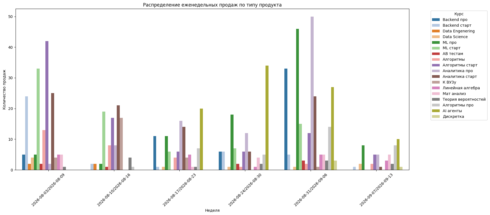

# Поступашки: Marketing Measurement System

Решение кейс-чемпионата по аналитике данных. Цель проекта — связать маркетинговую активность, рекламные касания, лиды и оплаты, а затем рассчитывать атрибутированную выручку, ROAS и ROMI.

## Данные

| Набор данных | Статус | Содержание |
|---|---|---|
| `data/raw/base.csv` | Реальные обезличенные данные | Продажи: student_id, сумма, продукт и время покупки |
| `data/raw/tg_posts_text.json` | Реальные публичные данные | История постов основного Telegram-канала |
| `data/processed/analysis_posts.csv` | Производный набор | Подготовленная таблица Telegram-публикаций |
| `data/mock/` | Synthetic/mock данные | Демонстрационные размещения, касания и покупки для MVP |
| `data/processed/external_placements.csv` | Планируемый/может быть пустым | Подтверждённые внешние рекламные размещения |

### Ограничения данных

- История продаж охватывает период 04.08–10.09.2026.
- Историческая связь `реклама → конкретный пользователь → конкретная покупка` не восстанавливается достоверно без tracking identifiers.
- Публичные посты сами по себе не подтверждают стоимость размещения.
- Поэтому точная историческая атрибуция ограничена, а полная логика измерения проверяется на synthetic/mock данных и в проектируемом MVP.

## Первый результат анализа

Ниже показано распределение еженедельных продаж по продуктам.



## Структура проекта

```text
postupashki-hackathon/
├── README.md
├── requirements.txt
├── data/
│   ├── raw/          # исходные данные без изменений
│   ├── processed/    # очищенные таблицы и события
│   └── mock/         # тестовые данные MVP
├── docs/             # спецификация измерения и архитектуры
├── notebooks/        # анализ продаж и графики
├── src/              # код MVP
└── outputs/
    └── charts/       # графики для презентации
```

## Минимальный MVP

```text
рекламное размещение
→ уникальная tracking-ссылка
→ Telegram bot / touch
→ lead
→ purchase
→ attribution
→ ROAS / ROMI
```

Для MVP рассматриваются две модели атрибуции: **Last Touch** и **Linear**, окно атрибуции — **30 дней**.

## Документация

- [Правила измерения и атрибуции](docs/measurement.md) — окно атрибуции, Last Touch, Linear, Organic / Direct, repeat purchases, revenue, ROAS и ROMI.
- [Marketing Data Model](docs/data_model.md) — таблицы `dim_*` / `fact_*`, ключевые поля и связи.
- [Telegram Bot Architecture](docs/bot_architecture.md) — роли, tracking link, `/newlink`, `/report`, `/status` и путь от рекламы до оплаты.
- [Historical Marketing Data](docs/historical_data.md) — работа с Telegram export и ограничения исторической атрибуции.
- [Synthetic / Mock Data](docs/synthetic_data.md) — сценарии генератора и контрольные проверки.
- [Контрольный synthetic-пример](data/mock/measurement_fixture.json) — небольшой тестовый набор для ручной проверки.

## Правила работы

- Не изменять данные в `data/raw/`.
- Отдельно маркировать реальные и synthetic/mock данные.
- Не публиковать персональные данные, секреты API, Telegram bot token и Telegram session files.
